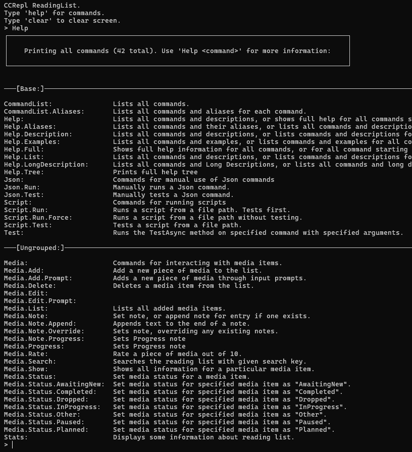

# Cornelius Conn Riordan - Portfolio
## Overview
I have an academic background in economics and finance, with a strong interest in data analysis, financial systems, and practical software tools.

This portfolio contains selected personal software projects focused on data tracking, analysis, and command-driven tooling. 
These projects were developed primarily in C#, using WPF for desktop UI, SQLite for data storage, and some additional work in C++.

The projects below were developed independently, and are featured here to demonstrate practical programming, data handling, and system design skills.

## Contents
- [MacroTrack](#macrotrack)
- [CCRepl](#ccrepl)

## MacroTrack
MacroTrack is a desktop macronutrient tracking application built in C# using WPF and SQLite.
It is designed for structured data tracking, analysis, and long-term monitoring of diet and habits.

I actively use this program as a personal data tracking tool, with ongoing updates.

Source code and documentation: [https://github.com/CorneliusRior/MacroTrack](https://github.com/CorneliusRior/MacroTrack)

### Features
- Food and weight logging with data visualisation.
- Configurable diet goals with real-time feedback.
- Daily task tracking with a streak system.
- Historical data viewing and editing.
- Theming options such as 'light', 'dark', and 'dark custom'.

### Technical details
- Built using C#, Windows Presentation Foundation (WPF) for UI, and SQLite for data storage.
- Command-line interface (REPL) with support for JSON-based scripts.
  - Scripts can be used for data migration and data generation (e.g. above screenshot).
  - I later rewrote the command system as a standalone project called [CCRepl](#ccrepl).
- Custom-built graphing systems (no external libraries).
- Custom-built UI elements for improved styling and control.
- Modular structure developed across multiple iterations and prototypes.

## CCRepl
CCRepl is a command system for building interactive applications with text-based input (command line / REPL). 
It allows text commands to be defined and structured quickly, with support for scripting and automation.

The system was first developed in C#, and later reimplemented in C++.

Source code and documentation (C#): [https://github.com/CorneliusRior/CCRepl](https://github.com/CorneliusRior/CCRepl)

### Features
- Hierarchical command structure with aliases.
- Automatic command registration and built-in help functions.
- Argument parsing and validation.
- Script execution using JSON-based scripts (C#).

### Technical details
- Designed as a reusable library for quickly developing command-driven tools, and early-stage project back-end development.
- Modular architecture separating command definitions from execution logic.
- The C++ version extends original design with features such as automatic argument prompting, automatic generation of usage statements, and command options.

### Notes
This system was originally developed as a component of [MacroTrack](#macrotrack), and later separated into a standalone library. It was designed to make the development of dynamic REPL systems as quick and efficient as possible.
